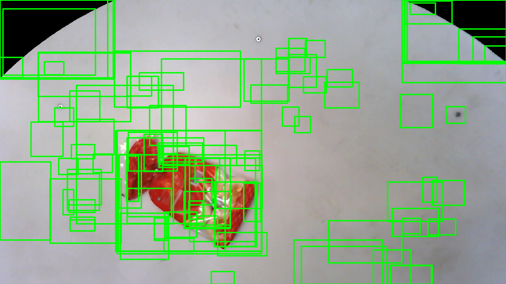

# Selective search implementation

## Performance

Tested on test data from dataset 3 folder.

Average run time: 27.48238032551135

Average number of region proposals: 5414.701271186441

### Example of genrated region proposals

Arm:

Background:

Bun:

Carrot:

Cat food beef:

Cat food salmon:

Ketchup:

Potato:

